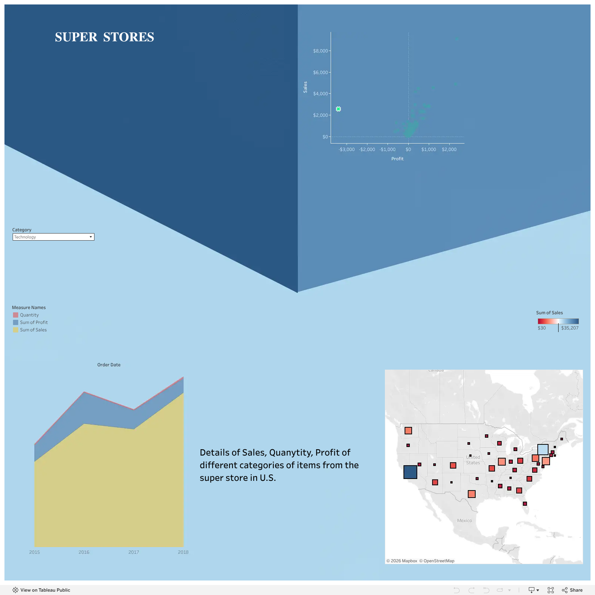

# BI Dashboarding (IBM Cognos)

A dashboard and report analyzing global suicide rates, 1985–2016 (public dataset), built in IBM Cognos Analytics.

- **`suicide[IBM cognos].cdd`** — the Cognos dashboard definition file.
- **`Suicideratesoverview_1985-2016[IBM cognos].pdf`** — exported report/overview.

## Tableau Public: Superstore sales dashboard

A Tableau dashboard on the standard Superstore sample dataset (U.S. retail): sales, quantity and profit by category over 2015–2018, a sales-vs-profit scatter to spot loss-making items, and a state-level sales map, filterable by category. Published live on [Tableau Public](https://public.tableau.com/app/profile/arjun2255/viz/superstore112d/SUPERSTORES_CATEGORY). The image above is a static preview.
