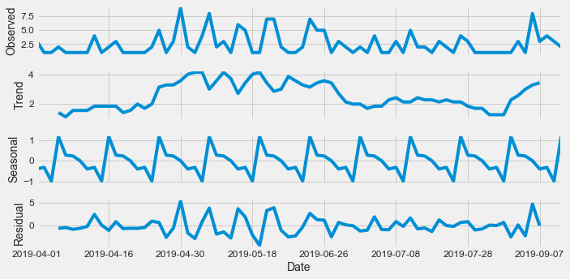
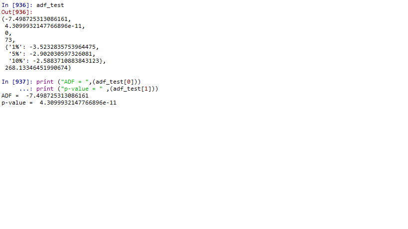
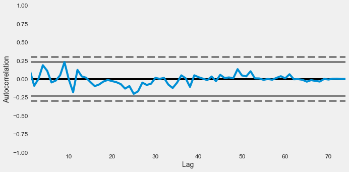

# Capstone: Demand Forecasting System ("DFS 1.0")

Trimester 5 capstone project (early 2020) — an end-to-end demand forecasting system for a food-service business, deployed as a Flask web application. Combines several techniques in one working pipeline rather than isolated exercises.

## What it does

1. **Data aggregation** — `EXL_agg.py`, `CLEANING.py`, `d_stats.py` aggregate raw order data into monthly (`CAP_MONTHwise/`) and total (`CAP_AGGRG/`) summaries.
2. **Time-series forecasting (ARIMA)** — `forecast_arima_model_function.py`, `combi_forecast.py`, `dateind_forecast.py`, `model.py` forecast future demand from the aggregated history.
3. **Market basket analysis (Apriori)** — `mba_association.py` (using `mlxtend`'s `apriori`/`association_rules`) and `market_basket_trial.py` mine item co-occurrence patterns — which items tend to be ordered together — from `APRIORI.xlsx`.
4. **Order quantity analysis** — `orderquantity.py` analyzes most-ordered items (treemap visualization via `squarify`).
5. **Web app** — `app1.py` / `deploy.py` (Flask entry points), `layout.py` / `layout_re.py`, `templates/`, `static/` present the forecasts and analysis through a browser UI ("DFS 1.0").

## Running it

Entry point is `app1.py` (or `deploy.py` for the deployment variant). Requires the Python packages imported at the top of each file (pandas, statsmodels/ARIMA tooling, mlxtend, squarify, Flask). File paths in some scripts are hardcoded to the original local environment and would need updating to run today.

## Analysis & diagnostics

Before fitting the ARIMA model, the demand series was checked for the structure that actually justifies it, rather than assumed:

Decomposing the series (Apr–Sep 2019) into trend, seasonal, and residual components confirmed a real recurring weekly-style pattern (the sawtooth "Seasonal" component) sitting on top of a slower-moving trend — not just noise.

An Augmented Dickey-Fuller test confirmed the series was stationary (ADF statistic **−7.499**, p-value **4.31e-11**, well below the 1% critical value of −3.523) — the precondition ARIMA actually depends on.

The autocorrelation plot showed most lags within the confidence bounds, with only mild short-term correlation around lag 5–10 — consistent with a well-specified model rather than leftover structure in the residuals.

## Background

Grounded in a short literature review on predictive analytics in supply chain forecasting (Fawcett, 2013, among others) — demand forecasting has traditionally driven supply chain planning, but practice often substitutes point estimates for genuinely unknown demand distributions, leading to insufficient safety stock and stock-outs. The project's framing (checking a demand series' actual structure before modeling it) responds directly to that gap. The business motivation was reinforced by contemporary reporting on food-quality/freshness issues at Indian restaurants and hotels, underscoring why accurate demand-driven inventory turnover matters operationally, not just statistically.
