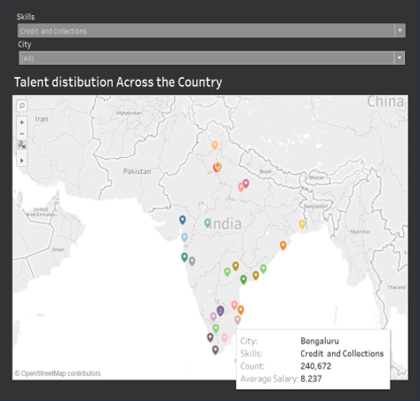
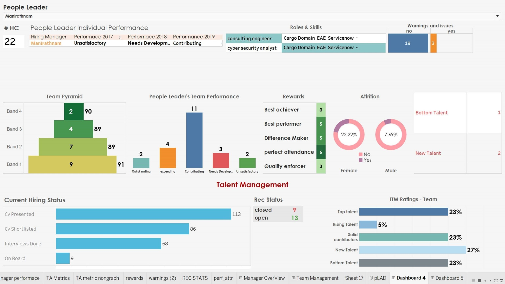

# Unisys HR Analytics Internship

MBA internship project (2019), working with a small team of MBA batchmates. Two HR-facing dashboards, built for and with Unisys — and the project where I first learned Python.

## The story

The team was asked to manually research and compile candidate-talent data (skills, location, experience, compensation) from Naukri.com to help the HR team figure out where hiring for specific skill sets should be focused across India. Doing that by hand, one search at a time, didn't scale. An exchange student on the team, Alex, who already knew Python, showed me how to automate parts of the process — that's how I started learning Python. `alex_1.py` in this folder is the first script I wrote as a result: it consolidates the separate data files each teammate had gathered into unified master sheets, ready for the dashboard to consume.

Two dashboards came out of the project:

### 1. Talent Distribution Heat Map

An interactive map of India showing where talent for a given skill is concentrated, filterable by skill and city, surfacing count and average salary per location — built to help HR decide *where* to focus hiring efforts for a given skill set.

### 2. Manager / Team Performance Dashboard

Built using mock data provided by the company as a design exercise — not real employee records. Gives a "People Leader" a single view of their team: performance ratings across years, team composition by band, rewards, attrition, and current hiring pipeline status.

## What's included here

- `alex_1.py` — the original data-consolidation script.
- `images/` — dashboard screenshots.

## What's deliberately not included

The raw Tableau workbooks and underlying spreadsheets aren't published here. Some of the underlying files mix in Unisys's actual internal job-role taxonomy alongside the project's own (mock) data, and untangling that reliably wasn't worth the risk — the screenshots capture the actual output faithfully without carrying any of that along.
